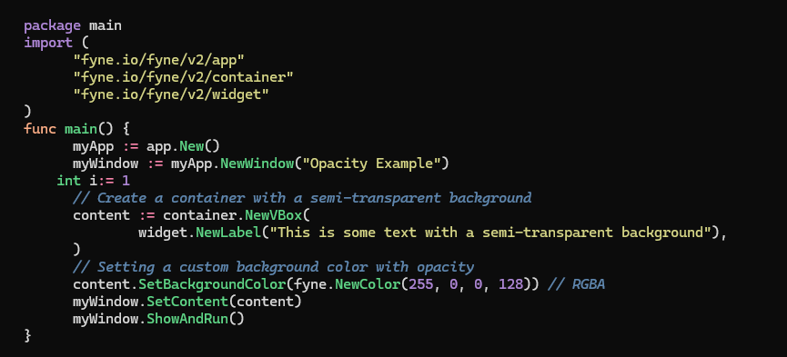

# Syntax Highlighter

A powerful `Syntax Highlighting` library inspired by [Pygments](https://github.com/pygments/pygments) and [Chroma](https://github.com/alecthomas/chroma), designed for versatility and ease of use. 

This library allows you to define styles, formatters, lexers, and tokens for highlighting code snippets across various programming languages.

## Features

- **Lexer Support**: Easily create lexers for different programming languages.
- **Styles**: You can define and use styles based on a [JSON file](./src/Styles/dracula.json), with configurations based on token types. This allows you to customize the appearance of highlighted code elements, such as keywords, strings, and comments, enhancing readability and visual appeal.
- **Formatters**: Format highlighted code output in various ways (HTML, terminal, bbcode, etc.).
- **Tokenization**: Break down source code into meaningful tokens for better syntax highlighting.

## Installation
TODO..

## Usage
Here is a quick guide on how to use the syntax highlighter in your project.

C#  syntax highlighter sample:
```csharp

string csharpSourceCode =
    @"```csharp
using System;

namespace SampleNamespace
{
    public class SampleClass
    {
        // A constant
        const int MaxValue = 100;

        // Entry point of the program
        static void Main(string[] args)
        {
            // Declare variables
            int number = 10;
            bool isEven = (number % 2 == 0);
            
            // Output
            Console.WriteLine($""Is the number {number} even? {isEven}"");

            // Loop
            for (int i = 0; i < MaxValue; i++)
            {
                Console.WriteLine(i);
            }

            // Function call
            DoSomething();
        }
    }
}";

Lexer lexer = new CSharpLexer();
Formatter formatter = new ConsoleFormatter256();
var style = await Style.LoadThemeByName("dracula");

var tokens = lexer.Tokenize(csharpSourceCode);
formatter.Format(tokens, Console.Out, style);
Console.WriteLine(); 

Console.ReadKey();
```


Golang syntax highlighter sample:

```csharp
string goSourceCode =
    @"```go
package main

import (
	""fyne.io/fyne/v2/app""
	""fyne.io/fyne/v2/container""
	""fyne.io/fyne/v2/widget""
)

func main() {
	myApp := app.New()
	myWindow := myApp.NewWindow(""Opacity Example"")

    int i:= 1

	// Create a container with a semi-transparent background
	content := container.NewVBox(
		widget.NewLabel(""This is some text with a semi-transparent background""),
	)

	// Setting a custom background color with opacity
	content.SetBackgroundColor(fyne.NewColor(255, 0, 0, 128)) // RGBA

	myWindow.SetContent(content)
	myWindow.ShowAndRun()
}
```";

Lexer lexer = new GoLexer();
Formatter formatter = new ConsoleFormatter256();
var style = await Style.LoadThemeByName("dracula");

var tokens = lexer.Tokenize(goSourceCode);
formatter.Format(tokens, Console.Out, style);
Console.WriteLine(); 

Console.ReadKey();
```



## Lexers

Lexers are responsible for breaking down the code into tokens. You can create a custom lexer by extending the Lexer class.

```csharp
public class NewLanguageLexer : Lexer
{
    // Implement required methods here
}
```

## Style

You can create and use custom style themes through a [JSON file](src/Styles/dracula.json), which allows for flexible configuration of the appearance of highlighted code. An example of a default theme is dracula.json, which might look like this:

```json
{
  "name": "Dracula",
  "foreground": "#f8f8f2",
  "background": "#44475a",
  "margin": 2,
  "styles": {
    "keyword": {
      "foreground": "#8be9fd",
      "bold": true
    },
    "comment": {
      "foreground": "#6272a4",
      "italic": true
    }
    // Additional token styles...
  }
}

```

In this structure, you can define specific styles based on token types (like `keyword` and `comment`), customizing attributes such as colors and font weights. 
This enables users to enhance the readability and aesthetic appeal of syntax-highlighted content according to their preferences.

## Supported Languages

- [x] C#
- [x] Golang
- [ ] Rust
- [ ] Java
- [ ] Typescript
- [ ] Javascript
- [ ] Python

## Contributing
Contributions are welcome! If you would like to contribute to the project, please fork the repository and submit a pull request.

## License
This project is licensed under the MIT License. See the [LICENSE](./LICENSE) file for details.
